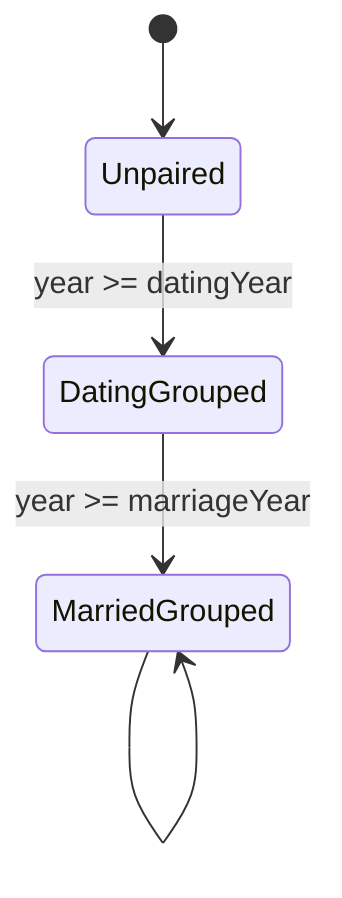
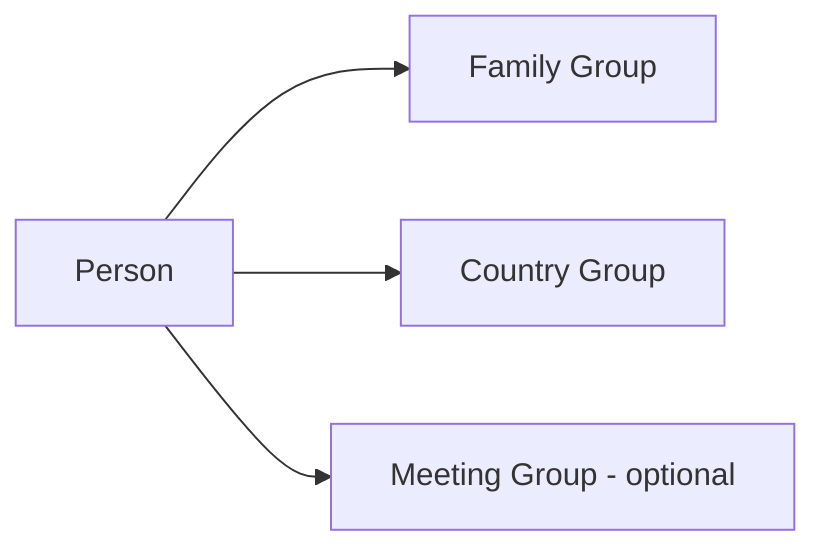

# Design Package V1

## Scope

This package converts approved requirements into a coherent design baseline, without implementation.

## Design Gate

Implementation remains blocked until @Lloydshove confirms this package and entries are marked in `DESIGN_REVIEW_LOG.md`.

## Confirmed Decision Updates (2026-09-07)

- Submission auth source: GitHub identity/session path.
- Rollback control: version history with revert support.
- Relationship rule: marriage may exist without dating year.
- Country transition boundaries: infer membership end from subsequent membership.

---

## 1) Data Model V2 (Proposed)

### Core entities

- `people`
- `groups`
- `memberships`
- `relationships`

### Proposed structures

```json
{
  "people": [
    {
      "id": "p1",
      "name": "Lloyd",
      "birthYear": null,
      "isChild": false
    }
  ],
  "groups": [
    {
      "id": "g-country-uk",
      "type": "country",
      "label": "United Kingdom"
    },
    {
      "id": "g-family-p1-p2",
      "type": "family",
      "label": "Lloyd + Partner Family"
    },
    {
      "id": "g-work-evolution",
      "type": "meeting",
      "subtype": "workplace",
      "label": "Evolution"
    }
  ],
  "memberships": [
    {
      "id": "m1",
      "personId": "p1",
      "groupId": "g-country-uk",
      "startYear": 2001,
      "endYear": null
    }
  ],
  "relationships": [
    {
      "id": "r-couple-1",
      "type": "couple",
      "from": "p1",
      "to": "p2",
      "datingYear": 2014,
      "marriageYear": 2019
    },
    {
      "id": "r-parent-1",
      "type": "parentChild",
      "from": "p1",
      "to": "p-child-1"
    }
  ]
}
```

### Notes

- Meeting groups are modeled but rendered only when toggle is enabled.
- Group memberships are reusable across country/family/meeting groups.
- Existing `relationshipTypes` can be retained during migration and mapped gradually.

---

## 2) Timeline and Grouping Rules

1. **Couple grouping**
   - No couple grouping before `datingYear`.
   - Light/soft couple grouping from `datingYear`.
   - Stronger couple/family grouping from `marriageYear`.

2. **Children**
   - Child node becomes visible at `birthYear`.
   - Child appears as smaller node relative to adults.
   - Child inherits family grouping visibility rules by membership.

3. **Country groups**
   - Person is visible inside all active country memberships at current year.
   - Membership active when `startYear <= year` and (`endYear` is null or `endYear >= year`).
   - When a person has sequential country memberships, `endYear` may be inferred from the next membership start.

4. **Overlapping groups**
   - A person may appear in family + country (and optional meeting groups) simultaneously.
   - Rendering must support nested/overlapping containment semantics.

5. **Meeting groups toggle**
   - Toggle off: meeting groups hidden, underlying person nodes remain.
   - Toggle on: meeting group overlays/containers rendered for active memberships.

---

## 3) Visual Strength Model (Dating vs Marriage)

- Define `groupStrength` states:
  - `none` (pre-dating)
  - `dating` (soft visual: lighter boundary)
  - `married` (strong visual: thicker/darker boundary)
- Group strength is derived from timeline year and couple milestones.

---

## 4) Mermaid Diagrams

### Entity relationship model

```mermaid
erDiagram
  PEOPLE ||--o{ MEMBERSHIPS : has
  GROUPS ||--o{ MEMBERSHIPS : includes
  PEOPLE ||--o{ RELATIONSHIPS : from
  PEOPLE ||--o{ RELATIONSHIPS : to
```

### Timeline state transitions for a couple



### Overlapping membership concept



---

## 5) Multi-Device and Stack Strategy (Design)

### Recommended direction

- Keep deployment GitHub-friendly (static assets runnable on GitHub Pages).
- Allow optional build only if it outputs static `index.html` + JS/CSS assets with no server dependency.
- Prefer incremental file-structure modularization first:
  - `graph.js` split into data/model/render/control modules (still vanilla JS).

### Responsive UX requirements

- Preserve drawer UX on mobile.
- Add desktop/tablet optimized panel layout and larger graph viewport controls.
- Normalize hit targets and typography scale per viewport breakpoints.

---

## 6) Rollout Slices (Small Changes First)

1. Schema design + migration map (no runtime changes).
2. Couple milestone logic (dating/marriage) design to implementation.
3. Child visibility on birth year + node size support.
4. Country membership groups + overlapping render baseline.
5. Meeting groups toggle (optional view layer).
6. Multi-device layout improvements.
7. Submission feature (basic auth + rollback-controlled direct live updates) last.

---

## 7) Risks and Design Controls

- **Complex overlap rendering**: mitigate via staged containment rendering rules.
- **Data migration risk**: version schema and provide transformation path.
- **Submission safety risk**: enforce rollback/audit primitives before enabling direct live updates.
- **UI density risk**: add toggles/layers and focus behavior to avoid clutter.

---

## 8) Open Design Questions

1. Should dating periods be allowed to end without marriage (and if so, how represented)?
2. Build policy finalization: strict no-build static vs optional build that outputs static assets.
